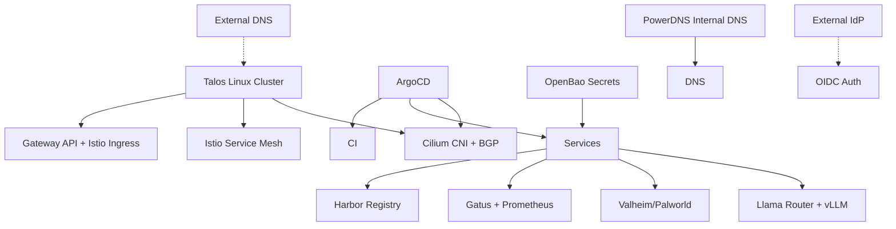

# Good Manners Hosting — Home Enterprise Labops

Kubernetes-based homelab and enterprise lab environment. Multi-node Talos Linux cluster running production-like workloads with comprehensive monitoring, CI/CD,
and identity management.

## Architecture



## Key Services

| Service | Namespace | Purpose |
|---------|-----------|---------|
| Cilium | kube-system | CNI, BGP, network policies |
| Istio | istio-system | Service mesh, mTLS, ZT |
| ArgoCD | argocd | GitOps continuous deployment |
| Argo Workflows | argo | CI workflow execution |
| Harbor | harbor | Private container registry |
| OpenBao | openbao | Secrets management |
| Llama Router | llm-router | Multi-backend LLM routing |
| nvidia-vllm | nvidia-vllm | NVIDIA GPU inference backend |
| intel-vllm | intel-vllm | Intel GPU inference backend |
| PowerDNS | powerdns | Internal authoritative DNS |
| Gatus | monitoring | Service health monitoring |

## LLM Infrastructure

The labops repo hosts the company's self-hosted LLM infrastructure:

- **Llama Router**: HTTP-based routing between multiple inference backends
- **NVIDIA vLLM**: RTX 5090 backend ($1.89/M input, $2.34/M output tokens)
- **Intel vLLM**: ARC B70 PRO backend for lighter workloads
- **Model cost tracking**: Per-model cost per token configuration

See `kubernetes/services/llm-router/` for deployment details.

> [!NOTE]
> In addition to the hardware above, we've got a 48GB Mac Mini M4 Pro switching between GPT-OSS 20B and [PrismML Bonsai 2 Ternary (Repo Linked Here)](https://github.com/GoodMannersHosting/home-enterprise-prismml-ternary-macos).

## Talos Cluster

The cluster runs Talos Linux (immutable, secure OS). Cluster configuration is managed by **Talos Orchestrator by PostFinance (TOPF)** — a community-maintained
orchestrator for managing Talos Linux clusters.

### Node Names
- `helo-armstrong` — master/control plane
- `helo-zephyr` — worker (GPU)
- `helo-quantumleap` — worker (Intel iGPU)
- `helo-stackover` — worker
- `helo-publicforum` — worker

## GitOps Workflow

```bash
# 1. Push changes to this repo
git add . && git commit -m "update..." && git push

# 2. ArgoCD automatically detects and syncs
# ArgoCD watches the repo and applies changes to the cluster

# 3. Monitor sync status
kubectl get application -n argocd
```

## Common Commands

```bash
# Seal a Kubernetes secret
task kubeseal -- path/to/secret.yaml

# View ArgoCD sync status
kubectl get application -n argocd

# Check Cilium connectivity
cilium status

# Trigger Argo workflow
argo submit -n cicd --from workflowtemplate/workflow-name

# Access OpenBao
export VAULT_ADDR=https://keeper.goodmanners.services
bao login -method=oidc role=keeper-admin
```

## External Dependencies

This cluster depends on services managed in the **cloud-security-cluster** repo
(Hetzner VPS at goodmanners.services):

- **Identity Provider (IdP)**: Authentik on Hetzner — cluster integrates via OIDC
- **Public DNS**: Cloudflare — cluster's ingress points to external DNS records
- **AWS KMS**: Used for OpenBao auto-unsealing
- **OpenBao**: Keeper secrets service at keeper.goodmanners.services

## Key Design Decisions

1. **GitOps-first**: All state managed through this repo, ArgoCD syncs
2. **Immutable infrastructure**: Talos Linux reduces attack surface
3. **BGP networking**: Cilium with BGP for robust internal routing
4. **Multi-GPU support**: Separate NVIDIA and Intel inference backends
5. **Cost tracking**: Detailed per-model cost accounting for LLM workloads
6. **Enterprise-grade CI**: Argo Workflows with Harbor for multi-arch builds
7. **Separation of concerns**: IdP and public DNS managed externally

## Testing

```bash
# Run pre-commit hooks
.venv/bin/pre-commit run

# Validate kubernetes manifests
kustomize build kubernetes/
```

## Secrets

Secrets are managed using **OpenBao** (Vault-compatible) with the External Secrets Operator.
Secret values are stored in OpenBao and synced to Kubernetes secrets via ExternalSecret resources.

- OpenBao server: `keeper.goodmanners.services` (managed by cloud-security-cluster)
- External Secrets Operator: `kubernetes/core/external-secrets/`

Legacy Sealed Secrets (`kubeseal`) are being phased out — use OpenBao/ESO for new secrets.
Seal new secrets using the `kubeseal` task **only** for backwards compatibility.
