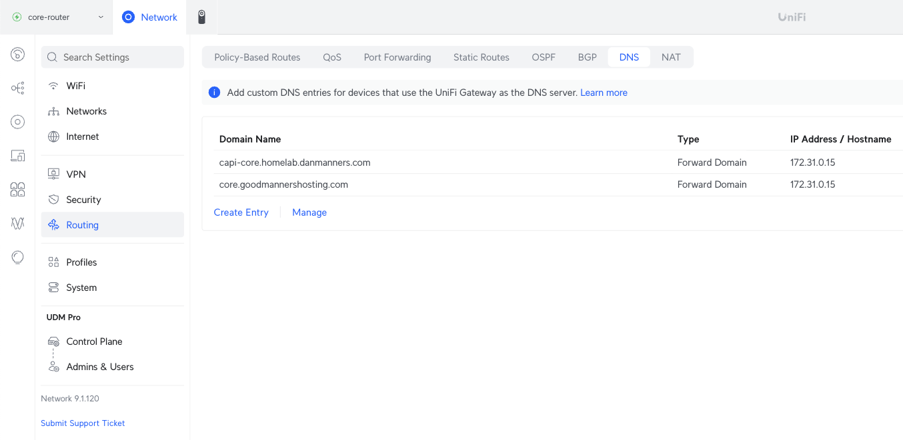

# PowerDNS

Much of this code has been adopted from [owndomainname/powerdns-stack-over-k8s](https://github.com/owndomainhome/powerdns-stack-over-k8s/tree/main) - give them a star!

## Generating a 128-character secret key

Both options below will generate a 128-character secret key.

```bash
# MacOS - openssl
openssl rand -base64 96 | tr -d '\n'

# MacOS - /dev/urandom
cat /dev/urandom | base64 | tr -dc '0-9a-zA-Z' | head -c128
```

## Upstream Router Domain Forwarding



Configure your router to forward your specified domains to the BGP IP of your PowerDNS server.

## Enabling Cert-Manager DNS-01 Auth with PowerDNS

If you want to use Cert-Manager to generate valid Let's Encrypt certificates, you need to make sure that your PowerDNS server is reachable from the internet. If you're using a Unifi Router, you can create a Port Forwarding rule to forward the DNS requests to your PowerDNS server. In **Settings > Routing > Port Forwarding**, create a new entry:


- WAN Port: 53
- Forwarding IP Address: `<BGP IP of your PowerDNS server>`
- Forwarding Port: 53
- Protocol: UDP

## Setting up your zones

```bash
curl -X POST \
    --data '{
    "name": "cloud.danmanners.com.",
    "kind": "Master",
    "dnssec": false,
    "soa-edit": "INCEPTION-INCREMENT",
    "masters": [],
    "nameservers": [
        "172.31.0.15."
    ]
}' \
    -vH "X-API-Key: $(kubectl get secrets -n powerdns as-secrets -ojson | jq -r '.data."api-key"|@base64d')" \
    http://172.31.0.16:8081/api/v1/servers/localhost/zones
```
